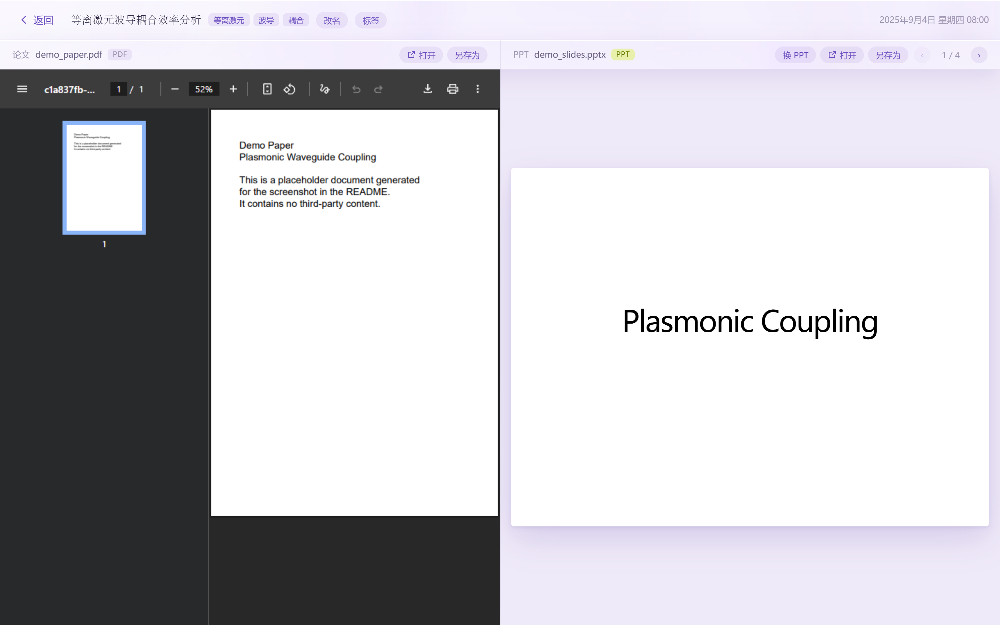

# 组会工作台

一个**离线**的桌面小工具 —— 把每次组会的**论文**和 **PPT** 并排放在一起对照阅读，
按时间排成一条可以转动的卡片带，翻页、改名、改幻灯片文字都在一个窗口里完成。

> 双击 `组会工作台.exe` 即用，**不需要安装 Python，也不联网**。
> 所有记录只保存在本机。

---

## 它解决什么问题

开组会时常见的麻烦：

- 论文 PDF 和汇报 PPT 散在文件夹里，要来回切窗口对页码；
- 上次讲到第几页，下次打开忘了；
- PPT 里发现错别字，得开 PowerPoint 改，改完还要重新上传。

组会工作台把这三件事收进一个窗口：**左边论文、右边 PPT**，各自记住阅读位置，
PPT 文字可以直接在应用里改并存回原文件。

---

## 界面

### 首页 —— 悬浮的卡片带

每次组会成为一张小卡片，围成一个**圆柱**缓缓自转，像悬浮在太空里（每张卡片还有
自己的漂浮节奏和角度偏移，不是整齐排队）。鼠标**按住拖动**可以旋转整圈，点一下卡片进入阅读。

- **搜索框** —— 按组会名称、论文名、PPT 名、标签实时过滤，`Esc` 清空
- **标签筛选片** —— 点一下只看该标签的组会，「全部」取消筛选

### 阅读页 —— 左论文，右 PPT

顶部工具条从左到右：**返回** · 组会名称 · **标签** · **改名** · 论文区（打开 / 另存为）·
PPT 区（换 PPT / 打开 / 另存为 / 翻页）。

| 功能 | 说明 |
|---|---|
| **改名** | 改这条组会的名称。只改名字，论文、PPT、标签、阅读进度都不动 |
| **标签** | 随时增删标签，首页筛选片同步更新 |
| **改文字** | 直接编辑幻灯片里的文字，改完保存写回 `.pptx` |
| **换 PPT** | 换掉整份幻灯片，不用重建组会记录 |
| **打开 / 另存为** | 调本机程序打开原文件，或另存一份 |
| **← → 翻页** | 翻 PPT 上一页 / 下一页，记住看到第几页 |

---

## 支持的文件格式

| 类型 | 支持 |
|---|---|
| 论文 | PDF、Word（`.docx`） |
| 幻灯片 | PowerPoint（`.pptx`） |

旧版 `.doc` / `.ppt` 请先用 Office 另存为新格式。

---

## 数据存在哪

记录保存在 **exe 同目录**下自动生成的 `数据/` 文件夹里。
**把整个文件夹拷到另一台电脑，记录就跟着走。**

全程离线，数据只在本机，不会上传。

---

## 已知限制

「改文字」功能只能改**文字内容**（标题 / 正文 / 要点）：

- **版式、位置、图片、图表、动画改不了** —— 这是 `.pptx` 文件结构决定的；
- 一个文本框内如果本来混排了多种字体，改完会统一成第一种的样式。

要改这些，请用「打开」在 PowerPoint / WPS 里改，改完另存，再用「换 PPT」换进来。

---

## 运行环境

- Windows 10 / 11（x64）
- 依赖系统自带的 **WebView2** 运行时（Win11 已内置；Win10 若缺失，
  首次运行会由系统提示安装，或到微软官网下载
  [WebView2 Runtime](https://developer.microsoft.com/microsoft-edge/webview2/)）

---

## 开发说明

本项目原本是单文件 HTML + pywebview 的桌面程序，用 PyInstaller 打包成单个 exe。

- 应用本体是一个自包含的 HTML（内嵌脚本与资源）
- `pywebview` 提供窗口与文件读写桥接（打开 / 另存为 / pptx 读改）
- 打包：PyInstaller `--onefile`

---

## 许可

[MIT](LICENSE)
